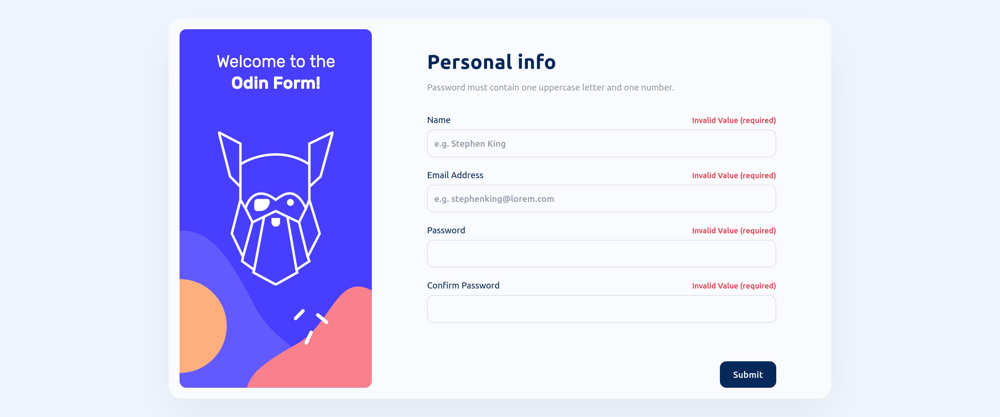

# Sign-up Form
One of the The Odin project projects from the Intermediate HTML and CSS course to practice HTML Forms and form validation with CSS styling. 

## Table of concepts
- [Overview](#overview)
  - [Screenshot](#screenshot)
  - [Links](#links)
- [Built with](#built-with)
- [Author](#author)

## Overview

### Screenshot

  - Desktop

  - Mobile

### Links
  - Live preview - [Sign-up Form](https://emrahiso.github.io/Sign-up-Form/)
  - GitHub repo - [Sign-up Form Repo](https://github.com/EmrahIso/Sign-up-Form.git)

## Built with 
  - HTML
  - CSS
  - FlexBox
  
## Author

- GitHub - [@EmrahIso](https://github.com/EmrahIso)

Credits to Frontend Mentor for design idea - [Frontend Mentor](https://www.frontendmentor.io/home)